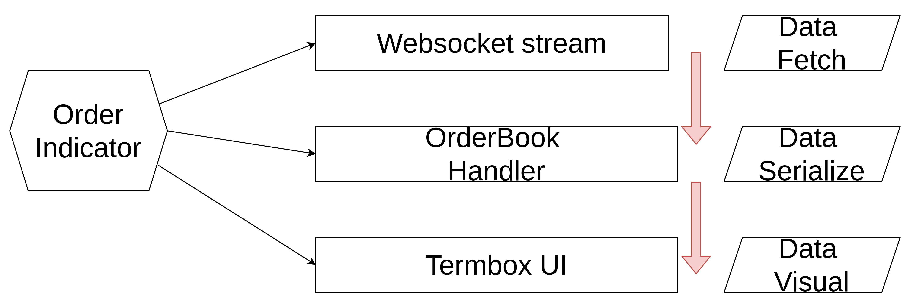
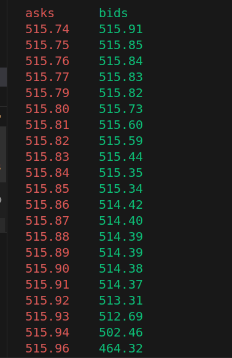

# golang-termdicator

This repository is for how to implements an indicator with golang

## resources

- Binance websocket futures api
```
wss://fstream.binance.com/stream?streams=btcusdt@depth
```

- AVL binary tree
```
github.com/VictorLowther/btree
```

- Websockets
```
github.com/gorilla/websocket
```

- Termbox for UI in the terminal
```
https://github.com/nsf/termbox-go
```

## data flow



## console view

